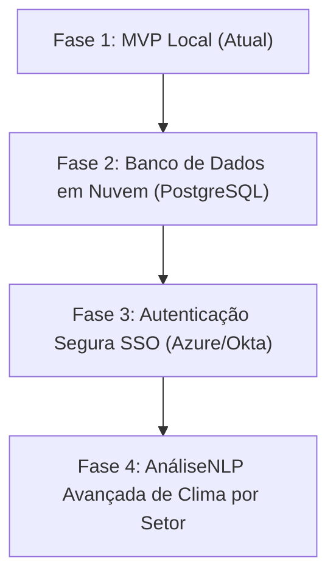

# 📖 Manual de Operações & Funcionalidades — MPB Conexão Humana

Bem-vindo ao **MPB Conexão Humana**, a plataforma definitiva para desenvolvimento de equipes, alinhamento de liderança (1:1s) e People Analytics. Este manual apresenta o guia completo de operação do sistema, suas regras de governança e seu valor corporativo.

---

## 🎯 1. Visão Geral do Produto

O **MPB Conexão Humana** foi projetado sob os mais modernos conceitos de Gestão de Pessoas e Inteligência Organizacional. A ferramenta serve como um facilitador de encontros de alinhamento individual (*one-on-ones*) e ciclos de feedback, eliminando as fricções de escrita e documentação das reuniões de equipe.

```
┌──────────────────┐      Atas Higienizadas       ┌──────────────────┐
│ LÍDER & LIDERADO │ ───────────────────────────► │ RECURSOS HUMANOS │
│ • Alinhamento    │                              │ • Analytics      │
│ • Assinatura OTP │      Dashboard & Alertas     │ • Governança     │
└──────────────────┘ ◄─────────────────────────── └──────────────────┘
```

> [!NOTE]
> **Foco na Confiança:**
> Acreditamos que a relação entre líderes e colaboradores se baseia em confiança. Por isso, a plataforma protege as comunicações contra termos excessivos ou invasão de privacidade, aplicando higienização automatizada por Inteligência Artificial antes de qualquer gravação permanente.

---

## 💡 2. Guia de Funcionalidades Principais

### 2.1. Jornada de 1:1 e Evolução de Carreira
O sistema auxilia o líder de equipe desde o planejamento até o encerramento do encontro:
1.  **Pautas Direcionadas:** O sistema analisa a função e o nível (L1, L2, L3) do colaborador para sugerir pautas e competências que precisam ser debatidas para sustentar o Plano de Desenvolvimento Individual (PDI).
2.  **Perguntas Dinâmicas:** Um questionário de 5 perguntas fechadas é exibido ao final da reunião. Suas redações variam a cada carregamento para manter o engajamento e evitar respostas repetitivas.
3.  **Flexibilidade de Escrita:** Não há exigência de tamanho mínimo de texto para feedbacks, permitindo registros ágeis que respeitam a agenda lotada dos gestores.

### 2.2. O Motor de IA (Moderação & Estruturação SBI)
Nossa inteligência artificial atua em conformidade com as regras de **Direitos Humanos e LGPD**:
*   **Modelo SBI:** Converte notas rústicas e informais do líder em parágrafos estruturados de acordo com o modelo de alta performance **Situação, Comportamento e Impacto (SBI)**.
*   **Filtros de Bem-estar:** Se o gestor incluir termos informais sobre saúde mental (como estresse, fadiga, depressão), a IA atua na prevenção de desvios legais, suavizando o tom para uma abordagem de suporte e aconselhando encaminhamento a canais profissionais especializados da empresa.
*   **Remoção de Adjetivos Negativos:** Críticas ríspidas ou linguagem informal inadequada são convertidas para feedbacks de caráter estritamente construtivo e profissional.

### 2.3. Assinatura Digital Segura (OTP)
Após a conclusão da reunião, a ata gerada pela IA é lida e assinada eletronicamente por ambos:
*   **Validação OTP:** O colaborador assina o documento inserindo um código numérico de uso único (OTP) simulado em sua caixa de entrada, garantindo a autoria e a segurança legal do registro de feedback.
*   **Visualização Controlada:** Apenas a ata formal estruturada (SBI) e as assinaturas constam no documento final, protegendo os rascunhos informais do líder.

### 2.4. Painel de RH & People Analytics
O RH dispõe de ferramentas de nível executivo para monitorar a saúde organizacional:
*   **Acompanhamento de Cadência:** Controle de atrasos e reuniões pendentes por equipes.
*   **Indicadores de Clima:** Análise do engajamento com base em perguntas fechadas de infraestrutura, metas e relacionamento.
*   **Auditorias Individuais Seguras:** O RH realiza o acompanhamento individual de PDIs e notas através de IDs anonimizados, respeitando a privacidade dos colaboradores na visão macro.

---

## 🛠️ 3. Especificações do MVP (Stand-alone & Portátil)

Para permitir a demonstração imediata do sistema sem configurações complexas de servidores ou bancos de dados locais, a versão MVP opera de maneira portátil:

*   **Simulador de Inbox:** Localizado na base da tela, simula em tempo real o recebimento de e-mails, atas em PDF geradas e tokens OTP de assinatura.
*   **Banco de Dados Local:** Todos os dados, reuniões salvas, históricos e feedbacks são guardados de forma segura no `localStorage` do navegador do usuário.
*   **Modo IA Híbrido:** O sistema opera localmente de forma autônoma. Caso o cliente queira utilizar o modelo Gemini avançado, basta inserir uma chave de API nas configurações do topo da página.

---

## 🔮 4. Próximos Passos e Evolução da Plataforma

Nossa equipe planejou a evolução da ferramenta com foco em escalabilidade de nível Enterprise:



1.  **Migração para Nuvem:** Substituição do armazenamento local por um banco de dados relacional robusto (PostgreSQL) sob criptografia ponta a ponta.
2.  **Single Sign-On (SSO):** Autenticação corporativa via SAML 2.0 / OAuth2 para integração simplificada com o ecossistema do cliente.
3.  **NLP para People Analytics:** Modelagem preditiva para estimar taxas de engajamento e estresse por departamentos, garantindo confidencialidade absoluta.

---

## 👥 Corpo Executivo do Projeto

O projeto é coordenado e executado por uma equipe dedicada à excelência operacional:

*   **João Pedro** — *Diretor de Produto (Product Director)*
    *   *Responsável pela concepção de produto, experiência do cliente (CX) e direção estratégica da plataforma.*
*   **Pedro** — *Arquiteto de Software (Software Architect)*
    *   *Responsável pela especificação técnica de engenharia, integridade estrutural e escalabilidade do MVP.*
*   **Gustavo** — *Especialista em IA & People Analytics (AI & Analytics Specialist)*
    *   *Responsável pelo refinamento do motor de IA, engenharia de prompts e lógica de análise de People Analytics.*
*   **Nathalia** — *Engenheira de Experiência do Usuário (UX/UI Engineer)*
    *   *Responsável pelo design visual premium, animações e responsividade da interface.*
*   **Mikael** — *Especialista em Governança, Compliance & LGPD (Governance Specialist)*
    *   *Responsável pela conformidade legal às regras de segurança de dados (LGPD) e Direitos Humanos.*
